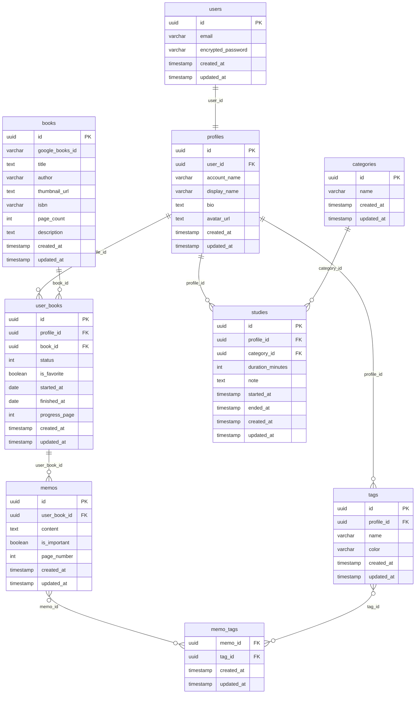

# Growth Tracker 🌱

読書・学習時間を一元管理し、自己成長を可視化するWebアプリ。

## デモ

- **URL:** https://growth-tracker-kohl.vercel.app/login
- **メール:** demodemo@email.com
- **パスワード:** demodemo@email.com

> ⚠️ デモアカウントは共有です。個人情報は入力しないでください。

---

## 概要

### ターゲット

読書や学習を習慣化したいが、記録が続かない人。

### 課題

- 読書記録と学習記録がバラバラで一元管理できない
- 継続できているかどうか可視化されていない
- メモや気づきを後から見返せない（どこにメモしていたかわからなくなる）

### 解決策

- 読書・学習を1つのアプリで記録し、ダッシュボードで成長を可視化する。
- 書籍ごとにメモ・タグ管理もできるので、後から振り返りやすい。

---

## 機能

- **認証:** メールアドレス・Googleアカウントでのログイン
- **ダッシュボード:** 今月の学習時間・今月の読書冊数・連続学習日数・総学習時間
- **読書管理:** 書籍検索（Google Books API）・本棚登録・読書ステータス管理
- **メモ・タグ:** 書籍ごとのメモ作成・タグ付け・重要メモ一覧
- **学習記録:** タイマー・手動入力でカテゴリ別に学習時間を記録
- **プロフィール:** アカウント名・表示名・アバター画像の設定

---

## アーキテクチャ図


---

## ER図



---

## 技術スタック

| カテゴリ | 技術 |
| --- | --- |
| フロントエンド | Next.js 16 / TypeScript / Tailwind CSS v4 |
| バックエンド | Supabase（Auth・DB・Storage）/ Prisma ORM |
| グラフ | Recharts |
| デプロイ | Vercel |

---

## 外部API

| API | 用途 |
| --- | --- |
| Google Books API | 書籍検索・書影取得 |
| Supabase Auth | メール・Google認証 |
| Supabase Storage | アバター画像の保存 |

---

## ローカル開発

```bash
git clone https://github.com/Rio-Sasaki/Growth-Tracker.git
cd Growth-Tracker
npm install
```

`.env.local` を作成して以下の環境変数を設定してください。

```
NEXT_PUBLIC_SUPABASE_URL=
NEXT_PUBLIC_SUPABASE_ANON_KEY=
NEXT_PUBLIC_GOOGLE_BOOKS_API_KEY=
```

`.env` を作成して以下の環境変数を設定してください。

```
DATABASE_URL=
DIRECT_URL=
```

```bash
npx prisma generate
npm run dev
```

[http://localhost:3000](http://localhost:3000) でアクセス