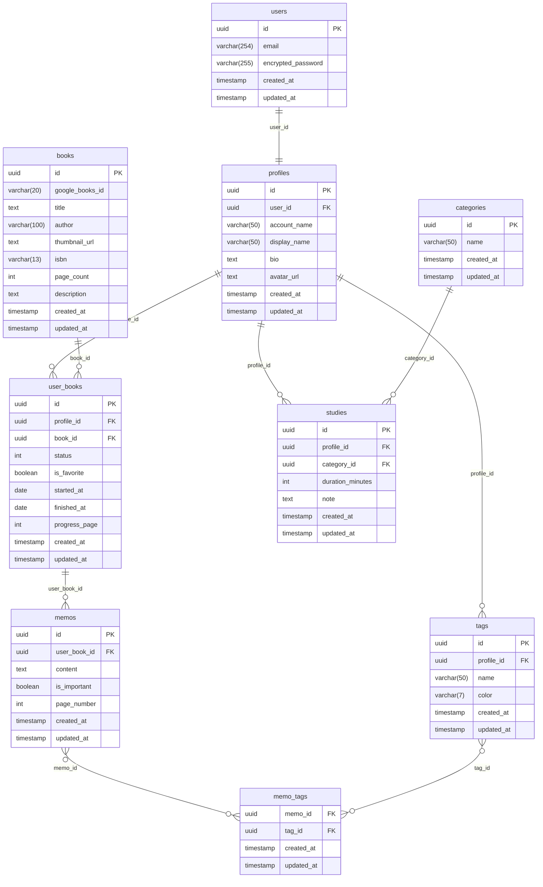

# データベース設計

## ER図

## テーブル定義

### users
| カラム | 型 | 説明 |
|---|---|---|
| id | uuid PK | プライマリキー |
| email | varchar(254) | メールアドレス |
| encrypted_password | varchar(255) | ハッシュ化されたパスワード |
| created_at | timestamp | 作成日時 |
| updated_at | timestamp | 更新日時 |

### profiles
| カラム | 型 | 説明 |
|---|---|---|
| id | uuid PK | プライマリキー |
| user_id | uuid FK | `auth.users.id` への参照 |
| account_name | varchar(50) | アカウント名（一意） |
| display_name | varchar(50) | 表示名 |
| bio | text | 自己紹介文 |
| avatar_url | text | Supabase Storage のアバター画像URL |
| created_at | timestamp | 作成日時 |
| updated_at | timestamp | 更新日時 |

### categories
| カラム | 型 | 説明 |
|---|---|---|
| id | uuid PK | プライマリキー |
| name | varchar(50) | カテゴリ名（例：プログラミング / 読書 / 資格） |
| created_at | timestamp | 作成日時 |
| updated_at | timestamp | 更新日時 |

### books
| カラム | 型 | 説明 |
|---|---|---|
| id | uuid PK | プライマリキー |
| google_books_id | varchar(20) | Google Books API のID（手動登録時はnull） |
| title | text | 書名 |
| author | varchar(100) | 著者名 |
| thumbnail_url | text | 書影URL |
| isbn | varchar(13) | ISBN（13桁） |
| page_count | int | 総ページ数 |
| description | text | 概要 |
| created_at | timestamp | 作成日時 |
| updated_at | timestamp | 更新日時 |

### user_books
| カラム | 型 | 説明 |
|---|---|---|
| id | uuid PK | プライマリキー |
| profile_id | uuid FK | `profiles.id` への参照 |
| book_id | uuid FK | `books.id` への参照 |
| status | int | 読書ステータス（0: 未読 / 1: 読書中 / 2: 読了） |
| is_favorite | boolean | お気に入りフラグ |
| started_at | date | 読書開始日 |
| finished_at | date | 読書終了日 |
| progress_page | int | 読書中の現在ページ |
| created_at | timestamp | 作成日時 |
| updated_at | timestamp | 更新日時 |

### memos
| カラム | 型 | 説明 |
|---|---|---|
| id | uuid PK | プライマリキー |
| user_book_id | uuid FK | `user_books.id` への参照 |
| content | text | メモ本文 |
| is_important | boolean | 重要フラグ（メモ一覧での絞り込みに使用） |
| page_number | int | 参照ページ番号（任意） |
| created_at | timestamp | 作成日時 |
| updated_at | timestamp | 更新日時 |

### tags
| カラム | 型 | 説明 |
|---|---|---|
| id | uuid PK | プライマリキー |
| profile_id | uuid FK | `profiles.id` への参照 |
| name | varchar(50) | タグ名（例：重要 / 復習 / 気づき） |
| color | varchar(7) | カラーコード（例：`#3B82F6`） |
| created_at | timestamp | 作成日時 |
| updated_at | timestamp | 更新日時 |

### memo_tags（中間テーブル）
| カラム | 型 | 説明 |
|---|---|---|
| memo_id | uuid FK | `memos.id` への参照 |
| tag_id | uuid FK | `tags.id` への参照 |
| created_at | timestamp | 作成日時 |
| updated_at | timestamp | 更新日時 |

### studies
| カラム | 型 | 説明 |
|---|---|---|
| id | uuid PK | プライマリキー |
| profile_id | uuid FK | `profiles.id` への参照 |
| category_id | uuid FK | `categories.id` への参照 |
| duration_minutes | int | 学習時間（分単位） |
| note | text | メモ（任意） |
| created_at | timestamp | 作成日時（学習日として代用） |
| updated_at | timestamp | 更新日時 |

## 設計上の決定事項

- **`users` テーブルはSupabase Authが自動生成**：`auth.users` を可視化したもので、直接カラムを追加せず `profiles` テーブルで拡張する。
- **`books` テーブルを共有リソースとして設計**：同じ書籍を複数ユーザーが登録した場合、`books` は1レコードを共有し `user_books` で各ユーザーの状態を管理する。`google_books_id` でのUPSERTにより重複を防ぐ。
- **タグをユーザーごとに管理**：タグはグローバルではなくユーザー固有とし、`profile_id` で紐づける。
- **`categories` テーブルはシステム固定**：カテゴリは管理者が決める固定値とし、ユーザーによる追加・編集は不可。`profile_id` は持たない。
- **`user_books.status` を int で管理**：値の意味はNext.js側で定義する。
  - `0` → unread（未読）
  - `1` → reading（読書中）
  - `2` → done（読了）
- **`studies.category` を `categories` テーブルに切り出し**：将来的なカテゴリ追加をDB側のINSERTだけで対応できるようにする。
- **自由記述欄は `text`、それ以外は `varchar(n)`**：上限が決まっているカラムは `varchar(n)` で制約を明示し、URLや長文は `text` で統一する。
- **`memo_tags` は中間テーブル**：`memos` と `tags` の多対多を管理するためだけのテーブル。
- **全テーブルに `created_at` / `updated_at` を追加**：`memo_tags` も含む。
- **命名規則**：他テーブルのPKを参照するFKは `テーブル名_id` の形式で統一（例：`profile_id` / `book_id`）。
- **RLS（Row Level Security）を全テーブルに適用**：`profile_id = auth.uid()` を条件とするポリシーで、他ユーザーのデータへのアクセスを禁止する。
- **`studies.duration_minutes` を整数で保存**：フロントエンドのタイマーで計測した値を分単位で保存し、集計計算はアプリ側で行う。学習日は `created_at` で代用する。
- **`profiles.account_name`**：URLや@メンションでの識別に使用する一意のアカウント名。`display_name` とは異なり重複不可。