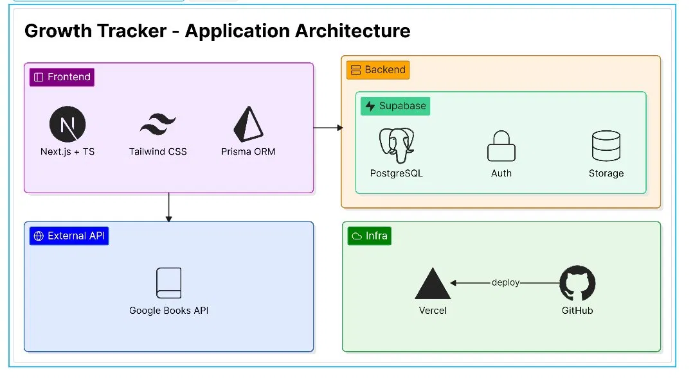

# 技術選定

## アーキテクチャ図

## 技術スタック

### Frontend

| 技術 | 選定理由 |
|---|---|
| Next.js | Reactベースのフレームワークであり、Server Actionsなど開発を効率化する機能を備えているため |
| TypeScript | 型安全性によるバグの早期発見とコード品質の向上 |
| Tailwind CSS | HTML上でスタイルを管理でき、CSSファイルを別で管理する必要がないため開発効率が高い |

### Backend

| 技術 | 選定理由 |
|---|---|
| Supabase | PostgreSQL・Auth・Storageでバックエンドの構築をまとめて対応できるため |
| PostgreSQL | Supabaseとの親和性が高く、RLSによるアクセス制御が可能 |
| Supabase Auth | メール認証・Googleログインに対応 |
| Supabase Storage | 画像の保存に使用 |
| Prisma ORM | SupabaseのPostgreSQLに対してTypeScriptで型安全にDBを操作できるため |

### 外部API

| 技術 | 選定理由 |
|---|---|
| Google Books API | 書籍検索に使用。無料で利用可能であるため |

### Infra / CI/CD

| 技術 | 選定理由 |
|---|---|
| Vercel | GitHub連携による自動デプロイが可能で、Next.jsとの親和性が高いため |
| GitHub | ソースコードのバージョン管理および公開に使用 |